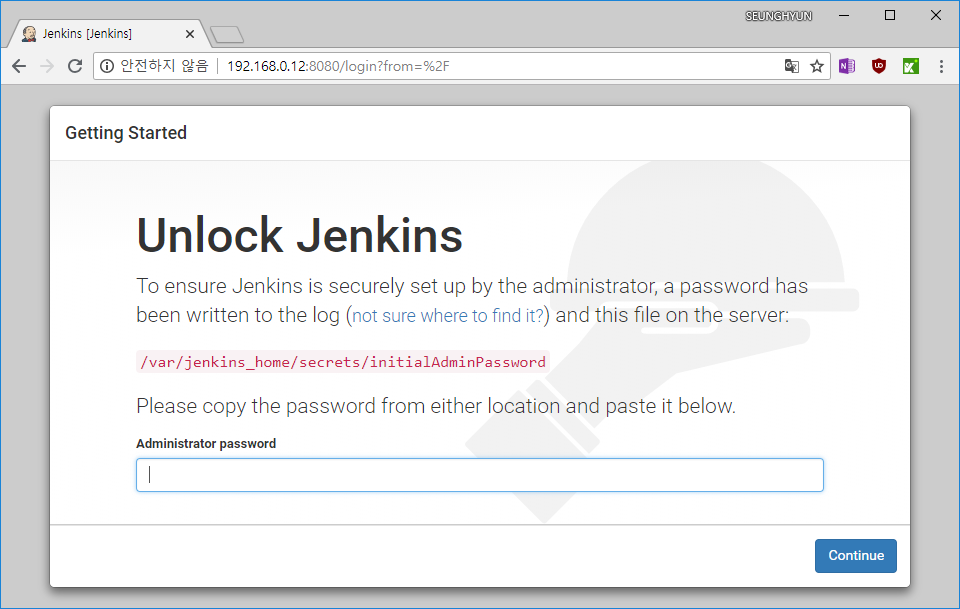

CI툴인 Jenkins를 설치하고 운영하려고 합니다.
일반적인 설치과정도 어렵진 않지만 docker로 컨테이너를 실행시켜 보겠습니다.

## 1. Jenkins 컨테이너 실행
##### *<U>윈도우는 커맨드 줄 끝의 \ 를 ` 로(esc아래 키) 바꾸시면 됩니다.</U>*

```console
# docker run --name jenkins \
            --detach \
            --volume /my/docker/volume/my-jenkins-home:/var/jenkins_home \
            --publish 8080:8080 \
            --env TZ=Asia/Seoul \
            jenkins

# docker ps
CONTAINER ID        IMAGE                      COMMAND                  CREATED              STATUS                   PORTS                               NAMES
c78da9c5ae57        jenkins                    "/bin/tini -- /usr/l…"   About a minute ago   Up About a minute        0.0.0.0:8080->8080/tcp, 50000/tcp   jenkins
```
Jenkins실행이 완료 되었습니다. 짝짝짝

## 2. Jenkins 최초 로그인하기

{: width="100%" height="100%"}<center>Jenkins 최초 콘솔화면</center>

"/var/jenkins_home/secrets/initialAdminPassword" 경로에 비밀번호를 숨겨놨으니 찾아와서 입력하라고 하는군요.

docker명령어로 비밀번호를 알아냅니다.
```console
# docker exec -it jenkins cat /var/jenkins_home/secrets/initialAdminPassword
a5a62c8d573c4a5682993f0820680349
``` 
"a5a62c8d573c4a5682993f0820680349"를 입력해주고 Jenkins를 마음에 드는 방식으로 세팅하시면 됩니다.

Docker로 jenkins를 구축해보기가 끝났습니다.
##### (Jenkins에 관한 내용은 다른 포스트로 찾아뵙겠습니다.)

***
### 설치환경
1. HostOS: Windows10 Pro 1809
2. Docker: 2.0.0.3
3. Image: jenkins:2.60.3 (https://hub.docker.com/_/jenkins)