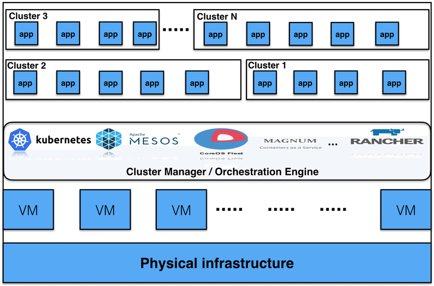
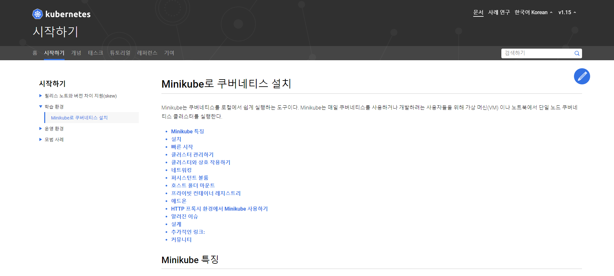
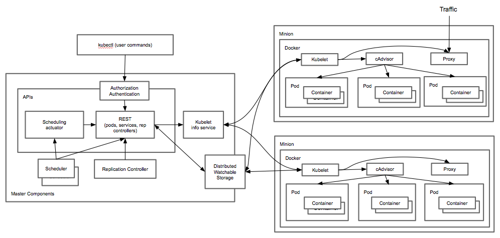

***********
온프레미스(On-premise)베이스의 제품을 클라우드 컨테이너기반의 제품으로 적용(테스트)시키는 개인적인 경험에 대한 시리즈입니다. 가볍게 읽어주시면 감사하겠습니다.

***********

사건 발생
---
(~~*잡소리~~) 제품을 클라우드 컨테이너에서 운영해야되는 상황이 발생했다는 제게 희노애락을 동시에 주는 소식이 전해졌습니다. 다른 인력에게 학습의 기회를 주고 싶었으나 (월급루팡은 중대사항입니다), 도커뿐만 아니라 제품의 빌드에 대한 이해도 같이 필요했기 때문에 "제가 보겠습니다"라는 말을 제 입이 허락없이 해버렸습니다.(아아ㅏ...)

처음 요구사항은 컨테이너 이미지로 만들기만 하면 된다는 쪼오금 부담되는 요구였습니다. 작년에 꿍쳐둔 도커파일을 다시 꼬깃꼬깃 꺼내서 컨테이너 이미지파일을 만들었습니다. 이미지 파일을 건네니 꽤나 부담되는 스케일링까지 진행해 달라는 요청이 되돌아왔습니다. 이렇게 쿠버네티스가 시작됩니다. 크흡...

목표
---
회사에서 주어진 최종 목표는 `제품의 스케일 아웃/인` 적용 시 정상작동입니다. ('만약 비정상 작동을하면 뜯어고쳐서 정상작동상태로 만들어라'까지 포함됩니다.)

#### 최종 목표: 스케일 In/Out 구현
- 단계별 목표
1. 쿠버네티스에 대한 개념 잡기
2. MiniKube 설치 따라하기 (개발/학습 환경)
3. 제품 컨테이너 구동하기
4. Pod으로 컨테이너 구동하기 (단일)
5. Pod으로 컨테이너 구동하기 (복수)
6. 로드밸런싱 하기
7. 스케일 아웃하기
8. (추가예정)

# 쿠버네티스에 대한 개념잡기
1\. 내가 이해한 쿠버네티스
---
쿠버네티스는 컨테이너 오케스트레이션 툴입니다. (~~쉽죠?~~)
>쿠버네티스는 단순한 오케스트레이션 시스템이 아니다. 사실, 쿠버네티스는 오케스트레이션의 필요성을 없애준다. 오케스트레이션의 기술적인 정의는 A를 먼저 한 다음, B를 하고, C를 하는 것과 같이 정의된 워크플로우를 수행하는 것이다. 반면에, 쿠버네티스는 독립적이고 조합 가능한 제어 프로세스들로 구성되어 있다. - https://kubernetes.io/ko/docs/concepts/overview/what-is-kubernetes/

SOA에서의 오케스트레이션 개념을 생각하고 쿠버네티스를 접했을때 너무 혼란스러웠습니다. 내가 알고 있는 오케스트레이션의 뜻과 너무 다른 모습이어서 말입니다. 하지만 위에 있는 글을 본 순간, 쿠버네티스에 대한 정의를 내릴 단어 중 가장 유사한 단어가 오케스트레이션이어서 사용하고 있다고 생각합니다.

`쿠버네티스의 본질`은 `대량의 컨테이너(수백, 수천)를 운영 및 관리를 도와주는 툴`이라고 봅니다. 컨테이너 20 ~ 30개를 운영, 관리한다고 생각하면 힘들지만 할 수 있을 것 같습니다. 그런데 컨테이너가 1000개 정도 되면 아휴... 저는 24/7 매달려도 관리 못 할 것 같습니다. 쿠버네티스를 쓰면 대량의 컨테이너를 관리해주고, 그 관리에 부가적으로 여러가지 기능(모니터링, 롤백, 로드밸런싱, 보안, 클러스터링, 배포전략 등등)들이 딸려온다고 합니다. (당장 도입하자!)

2\. 어떻게? 어디에? 설치 해야 돼?
---
구글에 "쿠버네티스" 검색중에 아래와 같은 그림이 나오고 내 맘대로 설치하기 겁이 납니다. 
{: width="100%" height="100%"}
[컨테이너 오케스트레이션 아키텍처]

여러 VM이나 서버에 뭔가 설치를 해야되는거 같은 그림같군요. 저는 단지 오토스케일링 테스트가 필요한건데 무작정 설치했다간 귀한 서버를 통으로 날려먹을까봐 손이 부들부들 떨리고 심장이 콩닥콩닥 뜁니다.(백업을 먼저 진행합니다) 이럴땐 항상 공식페이지에 가서 Getting Start를 찾아가는게 여러모로 좋은거 같습니다.

{: width="100%" height="100%"}
[시작하기]

공식 홈페이지에서는 miniKube를 통해서 진행하는 과정을 제공해주는군요. `miniKube는 개발자용으로 단일노드, 단일 클러스터를 제공`한다고 합니다.

3\. 아키텍쳐
---
{: width="100%" height="100%"}
[쿠버네티스 아키텍처]

~~굉장히 아름답고 훌륭한 그림이군요.~~

처음 보고 이해하는건 제게 불가능한 일입니다. 자꾸 보다보면 익숙해지고 친해지겠죠. `Minion`이 `Node`의 `옛이름`인 것을 알았습니다. Minion == Node 이군요. minikube를 설치하고 실행하면서 하나씩 발견하는 정보로 아키텍처 그림을 하나씩 이해하고 설명하고 넘어가보도록 하겠습니다.

다음편엔 miniKube를 설치하는 과정을 공식홈페이지를 보고 따라해보겠습니다.