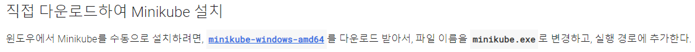
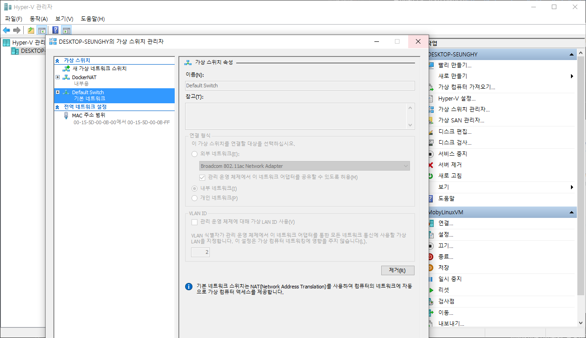

***********
온프레미스(On-premise)베이스의 제품을 클라우드 컨테이너기반의 제품으로 적용(테스트)시키는 개인적인 경험에 대한 시리즈입니다. 가볍게 읽어주시면 감사하겠습니다.

***********

시리즈
---
0. ~~쿠버네티스에 대한 개념 잡기 (추가예정)~~
1. MiniKube 설치하기 (Window10 pro)
2. ~~제품 컨테이너 구동하기~~
3. ~~Pod으로 단일 컨테이너 구동하기~~
4. (추가예정)

# MiniKube 설치하기 (Window10 pro)

0\. MiniKube란?
---
Minikube는 로컬에 Kubernetes를이용한 개발(or 학습) 환경을 제공합니다. 쿠버네티스 학습과 개발자를 위한 로컬환경 구성에 이용됩니다.

1\. MiniKube 다운로드
---
##### (\* 하이퍼 V 가상화가 가능해야 설치하실 수 있습니다.)

쿠버네티스 공식홈페이지(https://kubernetes.io/ko/docs/tasks/tools/install-minikube/)의 설치과정을 따라 가보겠습니다.

{: width="100%" height="100%"}<center>[minikube 직접 다운로드]</center>

2\. 이름 바꾸기
---
```console
# minikube.exe로 이름 바꾸기
C:\Users\kimse\minikube_test> rename minikube-windows-amd64.exe minikube.exe
```

3\. MiniKube 설정 변경
---
Minikube github: https://github.com/kubernetes/minikube/blob/master/docs/drivers.md#hyper-v-driver
```console
# vm-driver, hyperv-virtual-switch 설정하기
C:\Users\kimse\minikube_test> minikube config set vm-driver hyperv && minikube config set hyperv-virtual-switch "Default Switch"

! These changes will take effect upon a minikube delete and then a minikube start
```

제 로컬의 Hyper-V의 가상스위치 이름은 "Default Switch"입니다.
{: width="100%" height="100%"}<center>[Hyper-V 가상스위치 이름 확인]</center>

4\. MiniKube 실행하기
---
```console
# minikube 실행하기
C:\Users\kimse\minikube_test> minikube start
* minikube v1.3.0 on Microsoft Windows 10 Pro 10.0.17763 Build 17763
* Downloading VM boot image ...
    minikube-v1.3.0.iso.sha256: 65 B / 65 B [=====================] 100.00% 0s
    minikube-v1.3.0.iso: 131.07 MiB / 131.07 MiB [===============] 100.00% 12s
* Creating hyperv VM (CPUs=2, Memory=2000MB, Disk=20000MB) ...
* Preparing Kubernetes v1.15.2 on Docker 18.09.8 ...
* Downloading kubelet v1.15.2
* Downloading kubeadm v1.15.2
* Pulling images ...
* Launching Kubernetes ...
* Waiting for: apiserver proxy etcd scheduler controller dns
* Done! kubectl is now configured to use "minikube"
```
***

## 설치중에 발생한 오류 및 해결방법
```console
PS C:\Users\kimse\minikube_test> minikube start
minikube : 'minikube' 용어가 cmdlet, 함수, 스크립트 파일 또는 실행할 수 있는 프로그램 이름으로 인식되지 않습니다. 이름
이 정확한지 확인하고 경로가 포함된 경우 경로가 올바른지 검증한 다음 다시 시도하십시오.
위치 줄:1 문자:1
+ minikube start
+ ~~~~~~~~
    + CategoryInfo          : ObjectNotFound: (minikube:String) [], CommandNotFoundException
    + FullyQualifiedErrorId : CommandNotFoundException


Suggestion [3,General]: minikube 명령이 현재 위치에 있지만 이 명령을 찾을 수 없습니다. Windows PowerShell은 기본적으로  현재 위치에서 명령을 로드하지 않습니다. 이 명령을 신뢰하는 경우 대신 ".\minikube"을(를) 입력하십시오. 자세한 내용은 "get-help about_Command_Precedence"를 참조하십시오.
```
해결 방법: PowerShell이 아닌 Command(관리자)창을 띄워서 실행합니다. 


```console
C:\Users\kimse\minikube_test> minikube start
* minikube v1.3.0 on Microsoft Windows 10 Pro 10.0.17763 Build 17763
* Downloading VM boot image ...
    minikube-v1.3.0.iso.sha256: 65 B / 65 B [=====================] 100.00% 0s
    minikube-v1.3.0.iso: 131.07 MiB / 131.07 MiB [===============] 100.00% 12s
* Creating hyperv VM (CPUs=2, Memory=2000MB, Disk=20000MB) ...
E0807 00:56:02.074534 1376 start.go:723] StartHost: create: precreate: VBoxManage not found. Make sure VirtualBox is installed and VBoxManage is in the path
*
X Unable to start VM
* Error: [VBOX_NOT_FOUND] create: precreate: VBoxManage not found. Make sure VirtualBox is installed and VBoxManage is in the path
* Suggestion: Install VirtualBox, ensure that VBoxManage is executable and in path, or select an alternative value for --vm-driver
```
해결 방법: minikube의 --vm-driver와 hyper-V-switch설정을 세팅해주고 다시 실행
(https://github.com/kubernetes/minikube/blob/master/docs/drivers.md#hyper-v-driver)


***
### 시스템 환경
1. HostOS: Windows10 Pro 1809
2. Minikube: 1.3.0
