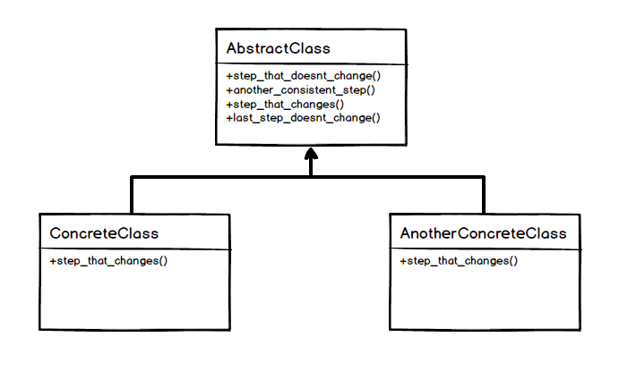

> ### Define the skeleton of an algorithm in an operation, deferring some steps to client subclasses. Template Method lets subclasses redefine certain steps of an algorithm without changing the algorithm's structure. - GoF
>
> ### 알고리즘의 뼈대를 오퍼레이션에 정의하고, 몇 개의 단계를 자식 클래스(subclass)에서 정의하게 미룬다. 템플릿 메소드는 알고리즘 구조의 변경 없이 자식 클래스에서 특정 단계의 알고리즘을 재정의 할 수 있게 해준다.

<center>Iterator UML Diagram</center>


장점
---
1. 동일한 로직을 유지.
2. 코드 중복 감소.
3. 자식 클래스의 역할 축소, 핵심로직 집중.
4. 자식 클래스의 추가, 확장에 용이.

단점
---
1. 부모 클래스(추상 클래스)의 소스코드를 모르면 자식클래스의 메소드 구현에 어려울 수 있다.

예제
---
### AbstractWorkOut.java
```java
package io.github.kimseunghyun_bg.templateMethod;

public abstract class AbstractWorkOut {

    public void todayWorkOut(){
        preparing();
        workout();
        shower();
    }

    private void preparing(){
        System.out.println("Preparatory movement");
    }

    abstract void workout();

    private void shower(){
        System.out.println("Taking a shower after workout");
    }

}
```
### PushUp.java
```java
package io.github.kimseunghyun_bg.templateMethod;

public class PushUp extends AbstractWorkOut {
    @Override
    void workout() {
        System.out.println("Push up!!!");
    }
}
```
### Running.java
```java
package io.github.kimseunghyun_bg.templateMethod;

public class Running extends AbstractWorkOut {
    @Override
    void workout() {
        System.out.println("Running!!!!");
    }
}
```
### Main.java
```java
package io.github.kimseunghyun_bg.templateMethod;

public class Main {
    public static void main(String[] args) {
        AbstractWorkOut pushUp = new PushUp();
        pushUp.todayWorkOut();

        AbstractWorkOut running = new Running();
        running.todayWorkOut();
    }
}
```
