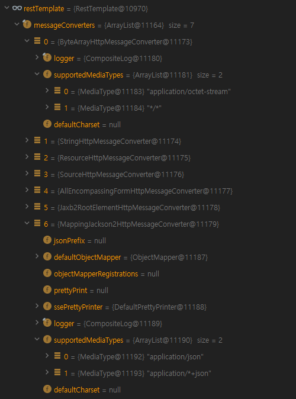

### 선 요약
외부 Rest API 서버의 응답의 ContentType이 `html/text`이며 json인 경우. 
1. `MappingJackson2HttpMessageConverter`에 처리할 수 있는 ContentType으로 `html/text`을 추가한다.
2. **1번**에서 만든 `MappingJackson2HttpMessageConverter`를 `RestTemplate`에 추가한다.
3. 그러면 `ResteTemplate`이 ContentType이 `html/text`인 json을 변환할 수 있다.

# 오류 발생 상황
## 배경
토이 프로젝트에서 외부 RestAPI를 호출하는 신규 기능을 구현했습니다. 이 기능은 `RestTemplate`로 외부 API를 호출합니다. 아래와 같이 응답을 String 클래스로 받을때는 정상동작을 합니다.  


```java
// ResponseType이 String.class인 정상 동작 코드
String response = restTemplate
    .postForEntity(URL, HttpEntity, String.class).getBody();

System.out.println(response);
// {"success":true,"status":"normal","api_ver":"2.6","action":"info"}
```

응답을 별도의 DTO클래스(CallInfoResponse)로 받고 싶어서 DTO클래스를 추가했습니다. 그리고 응답을 CallInfoResponse클래스로 받게 아래와 같이 리팩토링을 했습니다.

```java
@Getter @ToString
public class CallInfoResponse {
  private boolean success;
  private String status;
  private String api_ver;
  private ActionType action;
  private String error;
  
  @Override
  public boolean equals(Object o) { ... }
  @Override
  public int hashCode() { ... }
}
```
```java
// ResponseType이 CallInfoResponse.class인 리팩토링 코드
CallInfoResponse response = restTemplate
    .postForEntity(URL, HttpEntity, CallInfoResponse.class).getBody();
// Exception 발생
```
그러나 response에 응답값은 바인딩되지 않고 다음과 같은 오류가 발생했습니다.
## 로그 메시지
```text
org.springframework.web.client.UnknownContentTypeException: Could not extract response: no suitable HttpMessageConverter found for response type [class io.github.kimseunghyunbg.dto.CallInfoResponse] and content type [text/html;charset=UTF-8]
  at org.springframework.web.client.HttpMessageConverterExtractor.extractData(HttpMessageConverterExtractor.java:126) ~[spring-web-5.3.17.jar:5.3.17]
  at org.springframework.web.client.RestTemplate$ResponseEntityResponseExtractor.extractData(RestTemplate.java:1037) ~[spring-web-5.3.17.jar:5.3.17]
  at org.springframework.web.client.RestTemplate$ResponseEntityResponseExtractor.extractData(RestTemplate.java:1020) ~[spring-web-5.3.17.jar:5.3.17]
  at org.springframework.web.client.RestTemplate.doExecute(RestTemplate.java:778) ~[spring-web-5.3.17.jar:5.3.17]
  at org.springframework.web.client.RestTemplate.execute(RestTemplate.java:711) ~[spring-web-5.3.17.jar:5.3.17]
  at org.springframework.web.client.RestTemplate.postForEntity(RestTemplate.java:468) ~[spring-web-5.3.17.jar:5.3.17]
```
<br>

# 첫 번째 원인 분석
## 가설1
**"DTO 클래스가 잘못 개발되서 Json이 바인딩에 실패한다."**

위 가설은 단위테스트를 작성해서 확인해보겠습니다.  
`SpringBoot`은 기본적으로 `Jackson` 라이브러리를 Json 변환에 사용하기 때문에, `Jackson` 라이브러리를 이용해서 Json 변환 테스트를 해보겠습니다.
## 가설1 검증 
```java
// 단위테스트
import static org.assertj.core.api.Assertions.assertThat;

import com.fasterxml.jackson.databind.ObjectMapper;
import io.github.kimseunghyunbg.ActionType;
import java.io.IOException;
import org.junit.jupiter.api.Test;

class CallInfoResponseTest {
  @Test
  public void testDeserialize() throws IOException {
    //given
    final String json = """
        {"success":true,"status":"normal","api_ver":"2.6","action":"info"}""";
    //when
    CallInfoResponse actual = new ObjectMapper().readValue(json, CallInfoResponse.class);
    //then
    assertThat(actual.isSuccess()).isTrue();
    assertThat(actual.getStatus()).isEqualTo("normal");
    assertThat(actual.getApi_ver()).isEqualTo("2.6");
    assertThat(actual.getAction()).isEqualTo(ActionType.INFO);
    assertThat(actual.getError()).isNull();
  }
}
```
실행결과 Json이 DTO클래스로 잘 변환 됩니다. **가설1** 은 폐기합니다.
<br>

# 두 번째 원인 분석
## 가설2

**"content-type 이 text/html이기 때문에 적절한 MessageConverter가 없는 상태다"**

이제 로그를 다시 봐봅시다.

org.springframework.web.client.UnknownContentTypeException: Could not extract response: no suitable HttpMessageConverter found for response type [class io.github.kimseunghyunbg.dto.CallInfoResponse] and content type [text/html;charset=UTF-8]

ResponseType과 ContentType을 위한 적절한 `MessageConverter`를 찾을 수 없다고 합니다.

먼저 ResponseType이 Json변환에 맞게 개발되었는지 확인하기 위한 테스트를 가설1에서 했습니다. 그래서 ResponseType은 문제가 없군요.

다음으로 ContentType을 살펴보겠습니다. ContentType이란 HTTP의 본문의 원본 타입이 무엇인지 알려주는 역할을 하는 HTTP의 헤더(Header)입니다. ContentType이 `text/html`라니 무엇인가 이상합니다. 저는 보통 json값을 주고 받을때 ContentType은 `application/json` 였습니다.

이제 위 가설을 확인해보죠.

## 가설2 검증을 위한 지식 습득
exception 로그가 가르키는 마지막 메소드를 따라서 추적해봅시다.
```java
// 설명을 위해 클래스와 메소드를 축약했습니다.
public class HttpMessageConverterExtractor<T> implements ResponseExtractor<T> {
  
  private final List<HttpMessageConverter<?>> messageConverters;

  public T extractData(ClientHttpResponse response) throws IOException {
    MessageBodyClientHttpResponseWrapper responseWrapper = new MessageBodyClientHttpResponseWrapper(response);
    
    // 1. 응답 헤더의 contentType
    MediaType contentType = getContentType(responseWrapper);

    try {
      // 2. 여기서부터 MessageConverter가 contentType를 읽을 수 있는지 판별하는 구문
      for (HttpMessageConverter<?> messageConverter : this.messageConverters) {
        if (messageConverter instanceof GenericHttpMessageConverter) {
          GenericHttpMessageConverter<?> genericMessageConverter =
              (GenericHttpMessageConverter<?>) messageConverter;
          // 3. MessageConverter가 contentType를 읽을 수 있는지 판별 후 return
          if (genericMessageConverter.canRead(this.responseType, null, contentType)) {
            return (T) genericMessageConverter.read(this.responseType, null, responseWrapper);
          }
        }
        if (this.responseClass != null) {
          // 3. MessageConverter가 contentType를 읽을 수 있는지 판별 후 return
          if (messageConverter.canRead(this.responseClass, contentType)) {
            return (T) messageConverter.read((Class) this.responseClass, responseWrapper);
          }
        }
      }
    }
    catch (IOException | HttpMessageNotReadableException ex) {
      throw new RestClientException("Error while extracting response for type [" +
          this.responseType + "] and content type [" + contentType + "]", ex);
    }

    // 4. UnknownContentTypeException 발생 부분
    throw new UnknownContentTypeException(this.responseType, contentType,
        responseWrapper.getRawStatusCode(), responseWrapper.getStatusText(),
        responseWrapper.getHeaders(), getResponseBody(responseWrapper));
  }
}
```
위 메소드를 제가 붙인 주석을 따라서 필요한 부분만 읽어보도록 합시다.
1. getContentType 메소드를 사용해 응답(responseWrapper)에서 ContentType을 가져옵니다.
2. MessageConverters에서 `MessageConvert`를 하나씩 꺼내는 반복문을 실행합니다.
3. **2번**에서 꺼낸 `MessageConvert`가 if문에 따라 어느쪽을 선택 하든지 `canRead` 메소드를 만나게 됩니다. 여기서 `MessageConvert`가 responseType과 ContentType를 읽을 수 있는지 확인합니다. 그리고 읽을 수 있다면 `read`메소드를 실행해서 결과를 반환(return) 합니다. 
4. 만약에 모든 `MessageConvert`가 **3번**조건에 부합하지 않으면 `UnknownContentTypeException`를 발생시킵니다. 오류 로그는 이 부분을 가르키고 있습니다.

## 가설2 검증
RestTemplate안에 있는 `MessageConverters`가 처리할 수 있는 ContentType는 디버깅을 통해 확인해보겠습니다.



제가 사용하는 RestTemplate에는 `MessageConverter`는 총 7개가 있습니다. 각각의 `MessageConverter`는 처리하는 ContentType을 속석으로 가지고 있습니다.
- 첫 번째 `MessageConverter`는 `ByteArrayHttpMessageConverter`이고, 처리하는 ContentType으로 `application/octet-stream`, `*/*`가 있습니다.

저희가 필요한 `MessageConverter`는 7번째(index:6)에 있는 `MappingJackson2HttpMessageConverter` 입니다.
- `MappingJackson2HttpMessageConverter`가 처리하는 ContentType으로 `application/json`, `application/+json` 두 가지가 있습니다.

문제는 외부 API로부터 받은 응답의 ContentType이 `text/html`여서 `MappingJackson2HttpMessageConverter`이 json 변환을 처리하지 못한 것이었습니다.

## 해결 방안 모색

### 해결방안1
"응답을 String으로 받은 다음에 DTO 클래스 생성자의 파라미터로 넘기는 방법은 어떨까?"
- 고민사항
  - DTO마다 json변환 로직을 넣어야 합니다. DTO는 **데이터 전송 객체**라는 책임과 역할에서 크게 벗어나 보이진 않습니다. 하지만 로직이 DTO에 들어갈수록 개발자는 다른 DTO에도 로직을 넣기가 심리적으로 쉽습니다. 결국엔 책임과 역할을 벗어나는 DTO 탄생의 시발점이 될 수 있습니다.

### 해결방안2
"ContentType이 text/html으로 오는 json을 MappingJackson2HttpMessageConverter에서 변환하는 방법은 없을까?"
- 고민사항
  - 첫 번째로 `RestTemplate`에 `MessageConverter`를 추가하는 방법이 있어야 합니다.
  - 두 번째로 `MappingJackson2HttpMessageConverter`에 ContentType을 추가하는 방법이 있어야 합니다.

## 문제 해결
저는 **해결방안2**로 문제를 해결하였습니다. 아래는 `RestTemplate` `Bean`에 추가한 소스코드 입니다.
```java
@Bean
public RestTemplate restTemplate() {
  RestTemplate restTemplate = new RestTemplate();

  // 해결방안2 를 적용한 부분 /////////////////////////
  MappingJackson2HttpMessageConverter converter = new MappingJackson2HttpMessageConverter();
  converter.setSupportedMediaTypes(Collections.singletonList(MediaType.TEXT_HTML));
  restTemplate.getMessageConverters().add(converter);
  /////////////////////////////////////////////////

  HttpComponentsClientHttpRequestFactory factory = new HttpComponentsClientHttpRequestFactory();
  CloseableHttpClient httpClient = HttpClientBuilder.create()
      .setRedirectStrategy(new LaxRedirectStrategy()).build();
  factory.setHttpClient(httpClient);
  restTemplate.setRequestFactory(factory);
  return restTemplate;
}
```
이렇게 하면 `RestTemplate`에는 7개의 `MessageConverter`에 위에서 직접 추가한 `MappingJackson2HttpMessageConverter` 1개가 더 추가되어 총 8개의 `MessageConverter`를 가지게 됩니다. 그리고 새로 추가된 `MessageConverter`가 외부 API가 보낸 ContentType이 `text/html`인 Json 데이터 또한 처리할 수 있습니다.

## 회고

오류를 처리하는 과정은 실제로 좀 더 힘들었습니다. 외부 API 문서에는 ContentType에 대한 내용이 없었고, 당연히 application/json이라 짐작하고 오류를 찾으려고 했습니다. 그래서 오류 메시지가 "text/html"이라고 친절히 알려줘도 못보고 지나치고 엉뚱한데서 해메다가 돌아왔습니다. 역시 로그 확인을 꼼꼼하게 해야하는 습관은 중요한거 같습니다. 적은 비용으로 많은 정보를 알 수 있는 습관이니까요.  
지금 RestTemplate이 @Deprecated되어서 나중엔 RestTemplate을 WebClient로 교체하는 포스팅도 올리게 되면 좋겠습니다.

***
## 환경
OpenJDK17, SpringBoot 2.6.5, SpringWeb 5.3.17, Jackson 2.13.2, AssertJ 3.21.0, junit-jupiter 5.8.2